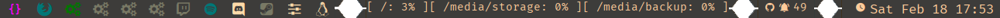

# Zonric's Dotfiles

### Herbstluftwm
Configs: ~/.config/herbstluftwm/

##### key binds???

---

### Polybar

---

### NeoVim 
##### General Plugins:
- [Packer](https://github.com/wbthomason/packer.nvim) : Package manager
- [Nvim-Tree](https://github.com/nvim-tree/nvim-tree.lua) : File Explorer
- [Mason](https://github.com/williamboman/mason.nvim) : LSP manager
- - [Mason-LSPConfig](https://github.com/williamboman/mason-lspconfig.nvim) : LSP configs
- - [LSPConfig](https://github.com/neovim/nvim-lspconfig) : LSP configs
- - [Fidget](https://github.com/j-hui/fidget.nvim) : LSP progress UI addon
- [CMP](https://github.com/hrsh7th/nvim-cmp) : Autocompletion
- - [CMP-LSP](https://github.com/hrsh7th/cmp-nvim-lsp) : Autocompletion from LSP
- [TreeSitter](https://github.com/nvim-treesitter/nvim-treesitter) : Syntax Parser
- - [TreeSitter-TextObjects](https://github.com/nvim-treesitter/nvim-treesitter-textobjects) : Syntax aware text-objects, select, move, swap, and peek support
- [BarBar](https://github.com/romgrk/barbar.nvim) : Buffer Bar (Tabs for opend files.)
- [Telescope](https://github.com/nvim-telescope/telescope.nvim) : Extendable Fuzzy Finder
- - [TSfzfNative](https://github.com/nvim-telescope/telescope-fzf-native.nvim) : fzf syntax for telescope

##### git related plugins
- [fugitive](https://github.com/tpope/vim-fugitive) : Git plugin
- [rhubarb](https://github.com/tpope/vim-rhubarb) : the Hub to fugitive's Git ... GitHub ;)
- [gitsigns](https://github.com/lewis6991/gitsigns.nvim) : Git decorations

##### Theme
- [OneDark](https://github.com/navarasu/onedark.nvim) : Theme inspired by Atom
- [LuaLine](https://github.com/nvim-lualine/lualine.nvim) : Nicer statusline
- [Comment](https://github.com/numToStr/Comment.nvim) : gc to comment visual regions/lines
- [Sleuth](https://github.com/tpope/vim-sleuth) : detect tabstop 
- [Colors](https://github.com/brenoprata10/nvim-highlight-colors) : Highlight colors hex, css, tailwind color values

##### Previews
- [MarkDown](https://github.com/iamcco/markdown-preview.nvim) : Live preview for md files

---

### Downloaded now what?
##### Switch from xrandr script to xorg configs : as of [[a3bde87]](https://github.com/Zonric/dotfiles/commit/a4bde87c1d05a1a7d6d9a98fa969c6f521bd9259)
- 20-amdgpu.conf: sets up amdgpu to use TearFree option (only for AMD GPUs)
- 30-monitors.conf: sets up my triple monitor settings: 

**Files need to be moved to /etc/X11/xorg.conf.d/**

`sudo cp ~/.config/xorg/*.conf /etc/X11/xorg.conf.d/`
